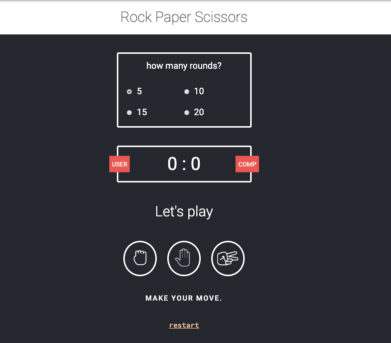
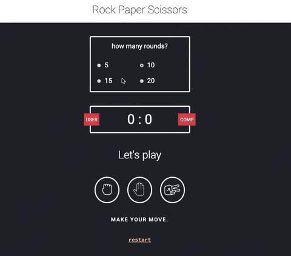

# Aufgabenstellung

Jeder hat in seinem Leben schonmal "Rock, Paper, Scissors" gespielt.
Es ist also nicht nötig, die Regeln zu erklären.

Definiere, wie viele Runden wir gegen den Computer spielen werden.
Die Farbe sollte sich ändern, wenn es sich um einen Gewinn, ein Unentschieden oder eine Niederlage handelt.

## Inhalt

Schere, Stein, Papier - DAS SPIEL! :)

## Assets

Benutzt für die Symbole normale Emojis:
✊
🤚
✌️

...alternativ benutzt eigene Icons oder benutzt Google für Alternativen.

__Font:__ 

Google-Font: Baloo-Cheetan (bereits im Code eingebunden)

## Ergebnisvorschau

